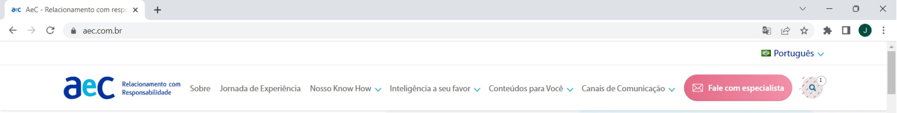
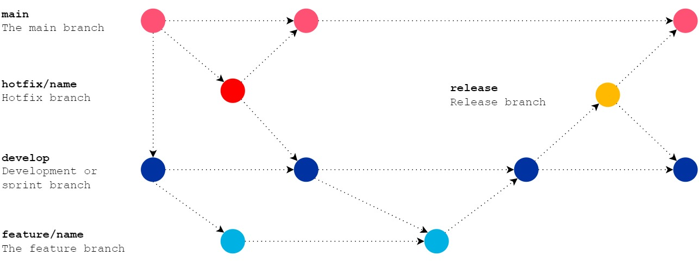

# Desafio AeC Automação

## Descrição do projeto

O projeto consiste em realizar a abertura automática do site da empresa [AeC](https://aec.com.br/), 
enviar através do campo de busca o termo *“Automação”* e efetuar a gravação do retorno obtido na página para o banco de dados.

## Pré-requisitos

- [x] Que o código seja feito em C#;
- [x] Utilização do framework Selenium;
- [x] Utilização da abordagem DDD com injeção de dependência;
- [x] Utilização de métodos assíncronos.

## Decisões técnicas

### SQL Server Express LocalDB

O banco de dados utilizado foi o [*SQL Server Express LocalDB*](https://learn.microsoft.com/pt-br/sql/database-engine/configure-windows/sql-server-express-localdb?view=sql-server-ver16). É possível habilitá-lo na instalação do Visual Studio ou através do Visual Studio Installer, ou ainda, através do download da mídia de instalação.

É um recurso que facilita a criação e a utilização de um banco de dados no próprio computador sem a necessidade de alguma instalação mais robusta e/ou que exija licença ou assinatura.

[(*)](https://learn.microsoft.com/en-us/sql/database-engine/configure-windows/sql-server-express-localdb?view=sql-server-ver16) _Microsoft SQL Server Express LocalDB is a feature of SQL Server Express targeted to developers. It is available on SQL Server Express with Advanced Services. LocalDB installation copies a minimal set of files necessary to start the SQL Server Database Engine._

Obs.: É possível facilmente alterar a conexão de string para outro banco de dados onpremisse como Microsoft SQL Server Express ou Microsoft SQL Server ou cloud como Microsoft Azure SQL Database.

### .NET 7

Foi escolhida a versão do .NET 7 por ser a versão mais recente atualmente com suporte (STS), também por questão de aprendizagem já que os projetos grande parte estão em versões anteriores.

### ASP.NET Core Web Api

Foi utilizado o ASP.NET Core Web Api devido ao tempo porém é funcional igual a um Windows Forms ou Console Application.

## Fluxo da Aplicação

```
Feature: Salvar busca da página inicial
    Salvar o primeiro item retornado na busca da página inicial no banco de dados

Scenario: Abra a página https://www.aec.com.br
	Given Clique na lupa a esquerda para iniciar a busca(1)
	And Informe o termo de busca na caixa de texto que abrirá logo em baixo, exemplo: Automação(2)
	And Clique na lupa a direita ao lado do texto digitado(3)
	And Selecione o primeiro item do retorno com informações da busca(4)
	And Salve no banco de dados os seguintes dados:
	|Título|Área|Autor|Descrição|Data de Publicação|
	Then Os dados devem estar armazenados no banco de dados
```




## Git Flow

Git flow utilizado para este projeto:



## Get started

Para executar o projeto é inserir uma conexão de string válida no arquivo contido no projeto "AeC.AutomationChallenge.WebApi" chamado "appsettings.Development.json" (necessário expandir o arquivo appsettings.json para visualizá-lo).

Após inserir a conexão de string, abra o "Package Manager Console", selecione o projeto "AeC.AutomationChallenge.Infrastructure" e execute os seguintes comandos:

```
- PM> Add-Migration
- PM> Update-Database
```
