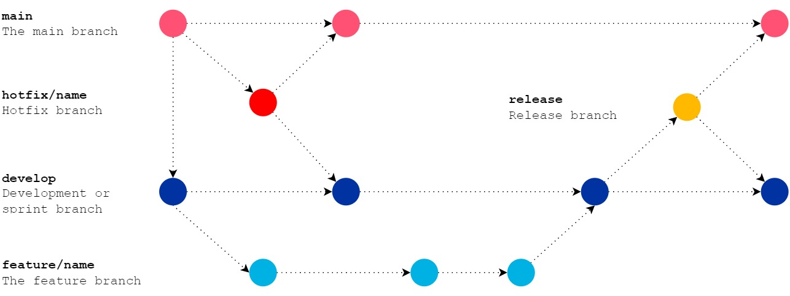

# Desafio AeC Automação

## Descrição do projeto

O projeto consiste em realizar a abertura automática do site da empresa [AeC](https://aec.com.br/), 
enviar através do campo de busca o termo *“Automação”* e efetuar a gravação do retorno obtido na página para o banco de dados.

#### Dados armazenados:
 
- Título;
- Área;
- Autor;
- Descrição;
- Data de Publicação;

## Pré-requisitos

- [ ] Que o código seja feito em C#;
- [ ] Utilização do framework Selenium;
- [ ] Utilização da abordagem DDD com injeção de dependência;
- [ ] Utilização de métodos assíncronos.

## Fluxo da aplicação

## Decisões técnicas

### SQL Server Express LocalDB

O banco de dados utilizado foi o [*SQL Server Express LocalDB*](https://learn.microsoft.com/pt-br/sql/database-engine/configure-windows/sql-server-express-localdb?view=sql-server-ver16). É possível habilitá-lo na instalação do Visual Studio ou através do Visual Studio Installer, ou ainda, através do download da mídia de instalação.

É um recurso que facilita a criação e a utilização de um banco de dados no próprio computador sem a necessidade de alguma instalação mais robusta e/ou que exija licença ou assinatura.

[(*)](https://learn.microsoft.com/en-us/sql/database-engine/configure-windows/sql-server-express-localdb?view=sql-server-ver16) _Microsoft SQL Server Express LocalDB is a feature of SQL Server Express targeted to developers. It is available on SQL Server Express with Advanced Services. LocalDB installation copies a minimal set of files necessary to start the SQL Server Database Engine._

Obs.: É possível facilmente alterar a conexão de string para outro banco de dados onpremisse como Microsoft SQL Server Express ou Microsoft SQL Server ou cloud como Microsoft Azure SQL Database.

## Git Flow

## Get started
